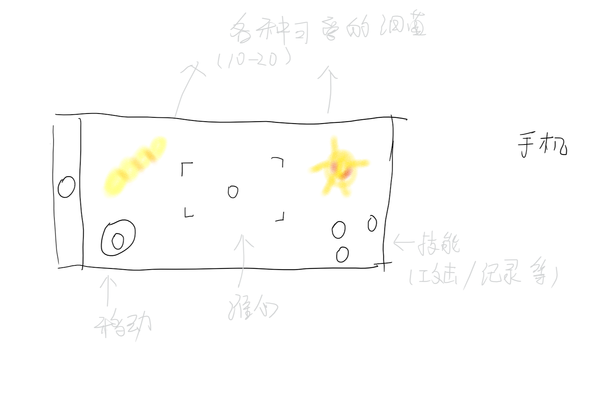
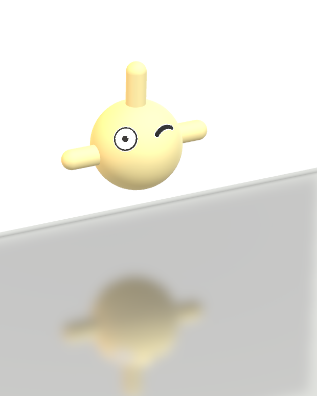

# Design-Documents
`jskyzero` `2018/04/05`

Germ Battle is a shooting AR game.

## Overview

细菌大作战是一个增强现实（AR）的射击游戏，游戏中将会遇到各种的（可爱的）细菌，除了消灭战役还有调查/捕捉等多种关卡。

+ 游戏定位：AR射击
+ 目标人群：喜欢AR游戏类型 / 喜欢可爱的细菌 的大众玩家
+  游戏特色：
  + 使用AR技术，细菌将会根据您的周围环境出现。
  + 可爱的细菌，预想中细菌将全部由开发人员自己建模。
  + 丰富的关卡和有趣的流程，带你解开平时看不到的细菌的世界。
+ MDA分析
  + Mechanics
    + 满足关卡条件（战斗/记录）
  + Dynamics
    + 可爱的细菌
    + 有趣的流程
  + Aesthetics
    + 有: 感官/叙事/挑战/探索/投入
    + 无: 幻想/伙伴/表达

## Todo

+ AR ENVIRMENT:  需要一个可以识别AR场景信息的工具（实在不行我们自己写，也不是太大问题）
+ MODEL: 需要自己做细菌素材

  

+ DESIGN: 进一步完善设计部分
