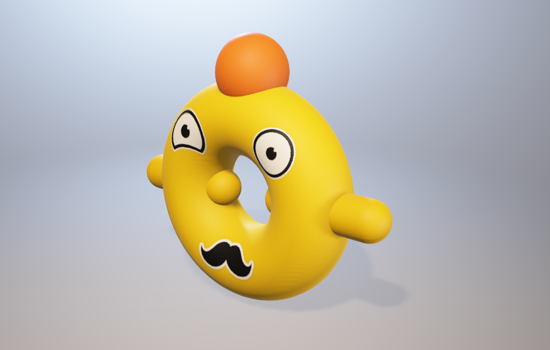

# 细菌设计
`jskyzero` `2018/04/09`

## 概述

每个人需要提出2-3个细菌

### 种族划分
> 暂时不补充具体种族的名称和设定。

无害类：天然无公害，威胁不强。
有害类：会主动攻击玩家。
亚种: 原细菌的变异。

### 外观

请尽量采用简单的几何体的组合。

### 属性

假定分为1-5个等级，具体数值需要结合武器计算。

+ HP：生命力
+ Speed：移动速度
+ IQ：智慧等级
+ Attack：攻击力

### 示例

随处可见的普通细菌。无害类

HP/Speed/IQ/Attack：3/2/2/1

偶尔会出现的大只细菌。偶尔会攻击人类

HP/Speed/IQ/Attack：4/1/3/3